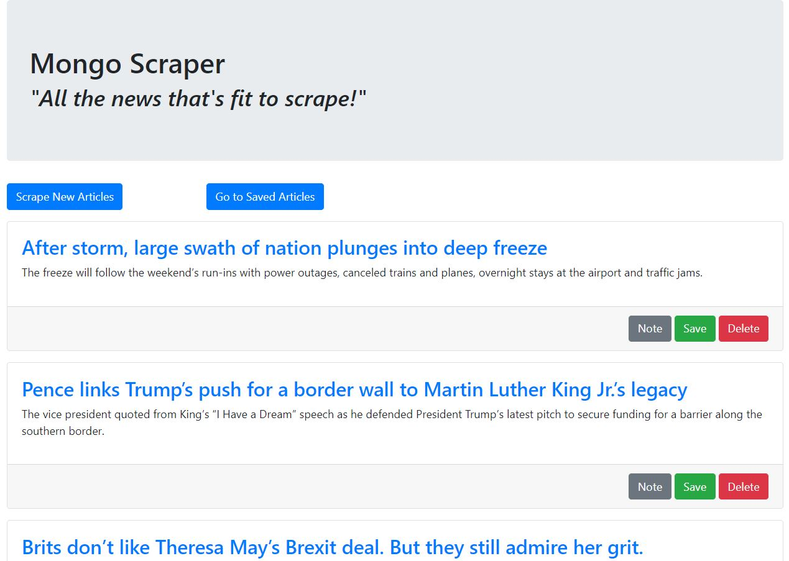
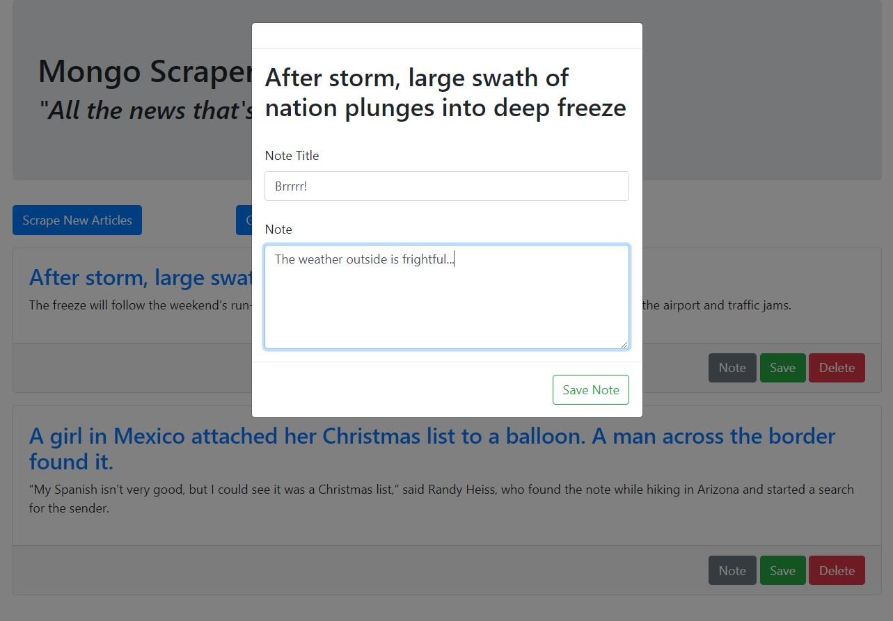

# Mongo_Scraper
An app that utilizes Mongoose and Cheerio to scrape news articles from the Washington Post, save them to a MongoDB database, and allows users to save and make notes on the articles.

To use the app, start by clicking the "Scrape New Articles" button to grab the latest articles. Click the "Save" button in an article's box to save that article for later, and access your saved articles by clicking the "Go to Saved Articles" button. You can save a note associated to an article using the "Note" button on an article's box, regardless of whether you've saved that article for later. The "Delete" button eliminates the article from the database. 

Link to deployed app: [https://evening-retreat-63220.herokuapp.com/](https://evening-retreat-63220.herokuapp.com/)

